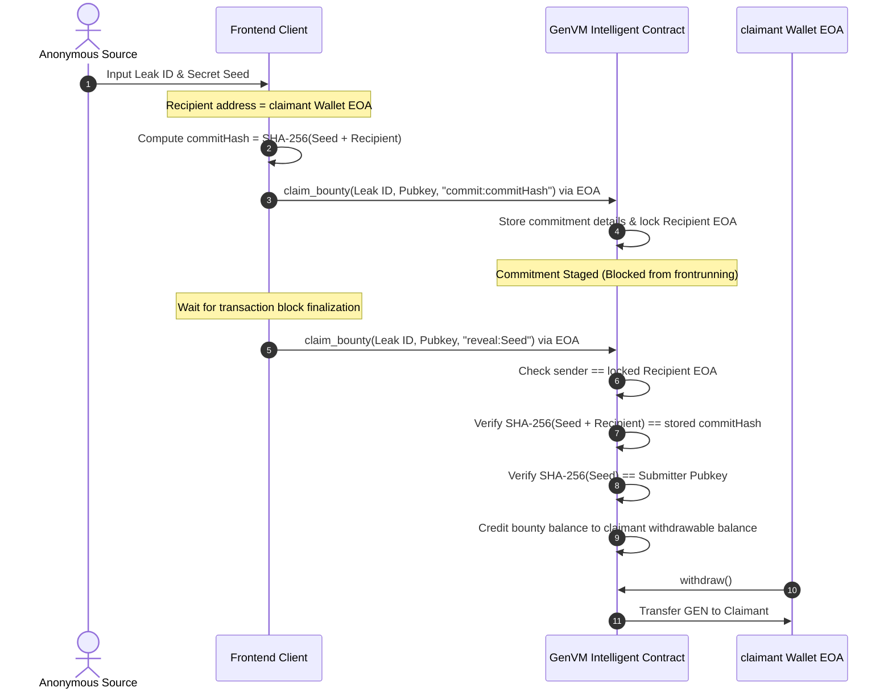

# 🕵️ DeadDrop - Decentralized Whistleblower Platform with AI Gatekeeper

DeadDrop is a decentralized, censorship-resistant whistleblower platform built on the **GenLayer blockchain**. An on-chain AI Gatekeeper (implemented as a GenLayer Intelligent Contract) automatically forensic-audits submitted documents, evidence, and public registry records before publishing their cryptographic fingerprints to a public ledger, protecting both journalistic integrity and anonymous sources.

---

## 📍 Deployed Contract Addresses

| Network | Contract Address | Explorer / Studio Link | Status |
| :--- | :--- | :--- | :--- |
| **GenLayer Studionet** | `0x0000000000000000000000000000000000000000` | [Studio View](https://studio.genlayer.com/) | *Development Mode / Live Testnet* |

> [!NOTE]
> Update the contract address in your `frontend/.env` file to point to your live deployed instance.

---

## 🔄 Commit-Reveal Bounty Protocol Sequence

The following diagram illustrates the frontrunning-resistant commit-reveal protocol used to claim DAO bounty pools:

---

## 🛡️ Threat Modeling & Mitigations

### 1. Frontrunning the Claim Seed
- **Threat:** A malicious node/validator listens to the mempool for a reveal transaction, extracts the seed, and submits a claim to their own address.
- **Mitigation:** The **commit phase** locks in the recipient wallet address before the seed is revealed. During the **reveal phase**, the transaction sender must match the locked recipient address, making intercepted seeds useless to frontrunners.

### 2. Sybil & Rate Limit Attacks
- **Threat:** Spammers flood the platform with fake leaks to exhaust validator computational resources.
- **Mitigation:** The contract enforces a **rate limit** of 1 submission per hour per pseudonymous public key. Submitting invalid/spam leaks decreases the submitter's **reputation score**, eventually blocklisting spam identities.

### 3. LLM Consensus Disagreements
- **Threat:** Validators run non-deterministic prompts that return slightly different JSON keys or floating scores, causing state forks.
- **Mitigation:** The contract utilizes `gl.eq_principle.prompt_comparative` with strict post-processing rules. Minor text differences in reasoning are ignored; consensus is strictly enforced on final categorical verdicts (VERIFIED/REJECTED).

---

## ⚡ 5-Minute Demo Walkthrough

1. **Identity Setup:** Navigate to the `/submit` page, rotate your pseudonymous identity, and generate a new single-use Burner Wallet.
2. **Submit a Leak:** Categorize your leak (e.g., environmental), write a summary, add evidence URLs, drag-and-drop a file to calculate its SHA-256 hash locally, and click **Initiate Audit Transmission**.
3. **Consensus Stream:** Watch the live Terminal console display real-time consensus stages (Forensic Auditing, SEC cross-referencing, and optimistic validation).
4. **Appeals:** If rejected, visit `/appeal/[leakId]` to stake 5 GEN and submit additional evidence URLs for an appellate re-evaluation.
5. **Withdraw Bounties:** Go to the `/treasury` page to view your secure withdrawable balance and withdraw earned GEN to your EOA.

---

## 📖 Additional Documentation
- [Architecture Deep-Dive](file:///Users/ai/.gemini/antigravity/scratch/deaddrop-platform/docs/ARCHITECTURE.md)
- [Whistleblower OPSEC Guide](file:///Users/ai/.gemini/antigravity/scratch/deaddrop-platform/docs/SECURITY.md)
- [Reproducible Deployment Steps](file:///Users/ai/.gemini/antigravity/scratch/deaddrop-platform/deployment/reproducible_steps.md)
