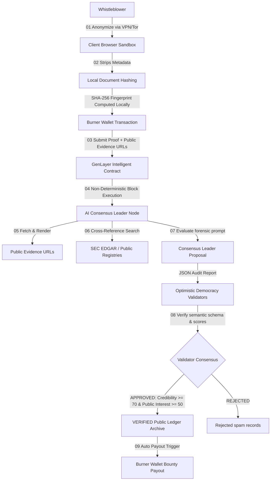

# 🕵️ DeadDrop - Decentralized Whistleblower Platform with AI Gatekeeper

> *"The truth, verified by AI. The source, protected by cryptography. The record, owned by humanity."*

DeadDrop is a decentralized, censorship-resistant whistleblower platform built on the **GenLayer blockchain**. An on-chain AI Gatekeeper (implemented as a GenLayer Intelligent Contract) automatically forensic-audits submitted documents, evidence, and public registry records before publishing their cryptographic fingerprints to a public ledger, protecting both journalistic integrity and anonymous sources.

---

## 🏗️ Architecture Overview

The following diagram illustrates how anonymous submissions traverse encryption, AI validator consensus, and permanent ledger publication:



---

## 🌟 Key Features

1. **Burner Wallet Mode (Default):** Client-side generated single-use keys transmit leak logs to the ledger, preventing any link to real-world identities or banking histories.
2. **Client-Side Hashing:** Raw documents are never uploaded to our servers or the blockchain. Only the SHA-256 fingerprint is stored on-chain, keeping source files completely secure.
3. **AI Editorial Consensus:** GenLayer Intelligent Contracts run non-deterministic LLM auditors to cross-reference evidence against public filing databases, calculating credibility ratings without centralized editors.
4. **Anti-Frontrunning Commit-Reveal Payouts:** Whistleblowers can safely claim DAO bounty rewards anonymously without exposing their key seeds in public transaction mempools.
5. **Academic and Journalist Toolkit:** Built-in citation generators and syndication triggers enable global portals to safely report verified leaks.

---

## 📍 Project Folder Structure

```
DeadDrop/
├── contracts/
│   ├── deaddrop.py               # Main Intelligent Contract
│   └── storage_test.py           # Minimal sanity-check contract (deploy first!)
├── frontend/
│   ├── src/
│   │   ├── app/                  # Next.js 14 App Router pages
│   │   ├── components/           # Custom cinematic UI components
│   │   ├── lib/                  # GenLayer client, ABI, & Crypto utilities
│   │   └── store/                # Zustand global state manager
│   ├── package.json
│   ├── tailwind.config.ts
│   └── tsconfig.json
├── docs/
│   ├── README.md                 # Project overview + setup
│   ├── DEPLOYMENT.md             # Step-by-step deploy guide
│   ├── ARCHITECTURE.md           # Technical deep-dive
│   ├── SECURITY.md               # OPSEC guide for whistleblowers
│   └── ETHICS.md                 # Ethical guidelines & content policy
└── .gitignore
```

---

## ⚡ Quick Start

### 1. Smart Contract Validation
Compile and deploy the Python contracts utilizing **GenLayer Studio**:
- Open the [GenLayer Studio](https://studio.genlayer.com/run-debug).
- Deploy `contracts/storage_test.py` to verify connection and counter.
- Deploy `contracts/deaddrop.py` following the non-negotiable studio rules.

### 2. Launch the Cinematic Frontend
Configure your environment and boot the Next.js development server:
```bash
# Navigate to frontend directory
cd frontend

# Install package dependencies
npm install

# Build environment variables config
echo "NEXT_PUBLIC_CONTRACT_ADDRESS=0xYOUR_DEPLOYED_CONTRACT_ADDRESS" > .env.local

# Launch local dev server
npm run dev
```

Open `http://localhost:3000` in your browser.

---

## 🛡️ Auditing & Security Policy

No tracking pixels, third-party analytics (Google Analytics, Sentry), or canvas-fingerprinting cookies are loaded. DeadDrop is optimized for maximum client safety inside the Tor Browser. Review [SECURITY.md](file:///Users/peter/AI/DeadDrop/docs/SECURITY.md) for extensive whistleblower OPSEC guidelines.
